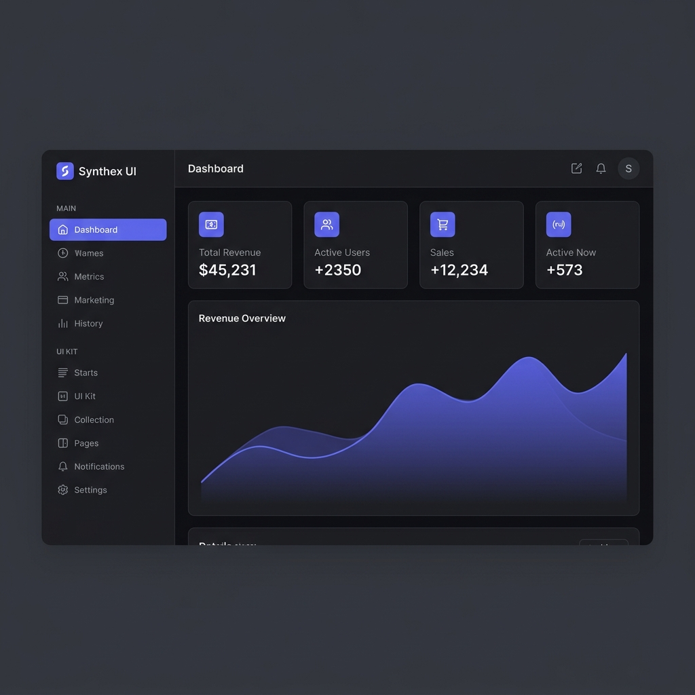

# Nexus Dashboard

A premium, open-source admin dashboard template built with **Next.js 14**, **Tailwind CSS**, and **Framer Motion**. Designed to be fast, beautiful, and developer-friendly.

[Live demo ](https://nexus-dashboard-phi-five.vercel.app/)



## ✨ Features

- 🌑 **Dark Mode First** — Deep Zinc dark theme with Indigo accent colors
- ⚡ **Next.js 14 App Router** — Modern, production-ready architecture
- 🎨 **Tailwind CSS** — Utility-first styling with zero bloat
- 🤖 **AI Assistant UI** — Floating chatbot panel with secure Human-in-the-Loop design
- 📊 **5 Chart Types** — Area, Bar, Line, Pie/Donut, and Radar (powered by Recharts)
- 🧩 **Full UI Component Kit** — Buttons, Forms, Badges, Tables, Charts
- 🔐 **Auth Pages** — Login, Register, and Forgot Password
- 🚨 **404 Error Page** — Custom animated not-found page
- 💫 **Framer Motion Animations** — Smooth entrance animations and hover effects
- 📱 **Responsive Layout** — Works on all screen sizes

## 📦 Pages Included (Free)

| Section | Pages |
|---|---|
| **Dashboard** | Overview with Stats, Revenue Chart, Recent Transactions, Top Users |
| **UI Kit** | Buttons, Forms, Badges, Tables, Charts |
| **Auth** | Login, Register, Forgot Password |
| **Errors** | 404 Not Found |
| **App Pages** | Analytics, Users, Products, Transactions, Settings (Pro placeholders) |

## 🚀 Quick Start

```bash
# 1. Clone the repository
git clone https://github.com/Pinky057/nexus-dashboard.git

# 2. Navigate into the project
cd nexus-dashboard

# 3. Install dependencies
npm install

# 4. Start the development server
npm run dev
```

Open [http://localhost:3000](http://localhost:3000) to view the dashboard.

## 🛠️ Tech Stack

| Technology | Version | Purpose |
|---|---|---|
| Next.js | 14 (App Router) | Core framework |
| TypeScript | 5 | Type safety |
| Tailwind CSS | 4 | Styling |
| Framer Motion | Latest | Animations |
| Recharts | Latest | Data visualization |
| Lucide React | Latest | Icons |

## 🔒 AI Security Design

The included AI Assistant panel follows strict **Human-in-the-Loop** principles:

- ✅ AI can **read** and **analyze** data freely
- 🚫 AI **cannot execute** destructive actions (DELETE, bulk updates) without explicit user confirmation
- 🔔 All sensitive AI actions require a **confirmation dialog** before execution
- 📝 Designed to be extended with a real backend (Node.js, Python) and real AI (Gemini, OpenAI)

## 💎 Pro Version (Coming Soon)

The free version is a fully functional starting point. The **Pro version** will include:

- Advanced data tables with export (CSV, PDF)
- Kanban board and Calendar
- CRM and Invoice management
- E-commerce product management
- Multi-language (i18n) support
- Light/Dark mode toggle
- Authentication with NextAuth.js

## 📄 License

This project is licensed under the **MIT License** — see the [LICENSE](./LICENSE) file for details.

---

Built with ❤️ by [Pinky057](https://github.com/Pinky057)

If this template helped you, please consider giving it a ⭐ star on GitHub!
